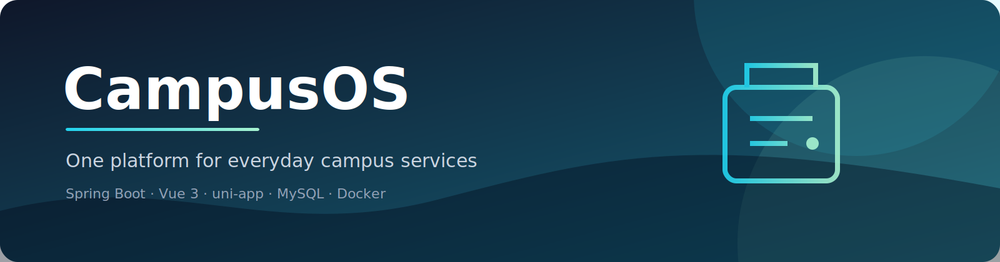

<div align="center">
  
  <p><strong>面向 Web、小程序与 API 的模块化校园综合服务平台。</strong></p>
  <p><a href="README.md">English</a> · <a href="https://github.com/lpzams/CampusOS/issues">问题反馈</a> · <a href="https://github.com/lpzams/CampusOS">代码仓库</a></p>
  
  
  
  
</div>

## 项目简介

CampusOS 将校园常用业务整合到一套平台中，覆盖账户认证、课程与选课、成绩、考试、新闻公告、活动、宿舍、校园卡、缴费、报修、二手交易、地图和可选的 AI 助手。

仓库包含 Spring Boot 后端、Vue 3 Web 端、uni-app 微信小程序端、数据库脚本以及爬虫和数据导出工具。各端共享 REST API，后端按领域层、应用层、基础设施层和接口层组织，便于持续演进。

## 系统架构

```text
Web / 微信小程序 → REST API · 统一 Result · JWT
                              ↓
             Spring Boot · 领域 / 应用 / 基础设施 / 接口
                              ↓
                         MySQL 8 · Redis
```

| 组件 | 目录 | 说明 |
| --- | --- | --- |
| 后端 | [`backend/`](backend) | Java 17、Spring Boot 3、MyBatis-Plus、Maven 多模块 |
| Web 端 | [`web/`](web) | Vue 3、TypeScript、Vite、Element Plus、Pinia |
| 小程序 | [`miniapp/`](miniapp) | uni-app + Vue 3 微信小程序客户端 |
| 数据工具 | [`web-crawler/`](web-crawler) | 爬虫、HAR 分析和 MySQL 种子导出 |
| 数据库 | [`docs/sql/`](docs/sql) | 初始化脚本、增量脚本和演示数据 |

## 快速开始

```bash
git clone https://github.com/lpzams/CampusOS.git
cd CampusOS
cp .env.example .env
docker compose up -d --build
```

| 服务 | 地址 |
| --- | --- |
| Web 门户 | http://localhost:8081 |
| API | http://localhost:8080 |
| MySQL | localhost:3306 |
| Redis | localhost:6379 |

首次启动会执行 `docs/sql/` 下的数据库脚本。演示账号为 `admin / 123456`，离开本地演示环境前请立即修改。

本地开发请先用 Docker 启动 MySQL 与 Redis，再运行 `backend/` 下的 `mvn spring-boot:run -pl campus-api`，最后在 `web/` 下执行 `npm install && npm run dev`。小程序端请使用 HBuilderX 或微信开发者工具导入 `miniapp/`。

## 配置与安全

复制 `.env.example` 为 `.env` 保存本地配置。不要提交真实 API Key、密码或证书。部署生产环境前必须替换演示数据库密码和 `CAMPUS_JWT_SECRET`，AI 凭据只能通过环境变量注入。

## 检查命令

```bash
cd web && npm run build
cd miniapp && node --test tests/*.test.mjs
cd backend && mvn test
```

## 项目文档

- [`docs/贡献指南.md`](docs/贡献指南.md) · 贡献指南
- [`docs/新增功能指南.md`](docs/新增功能指南.md) · 功能开发指南
- [`docs/sql/README.md`](docs/sql/README.md) · 数据库脚本说明
- [`接口文档.md`](接口文档.md) · API 接口文档

## 许可证

当前仓库尚未声明正式开源许可证。如需商业分发，请先联系项目维护者获得授权。
