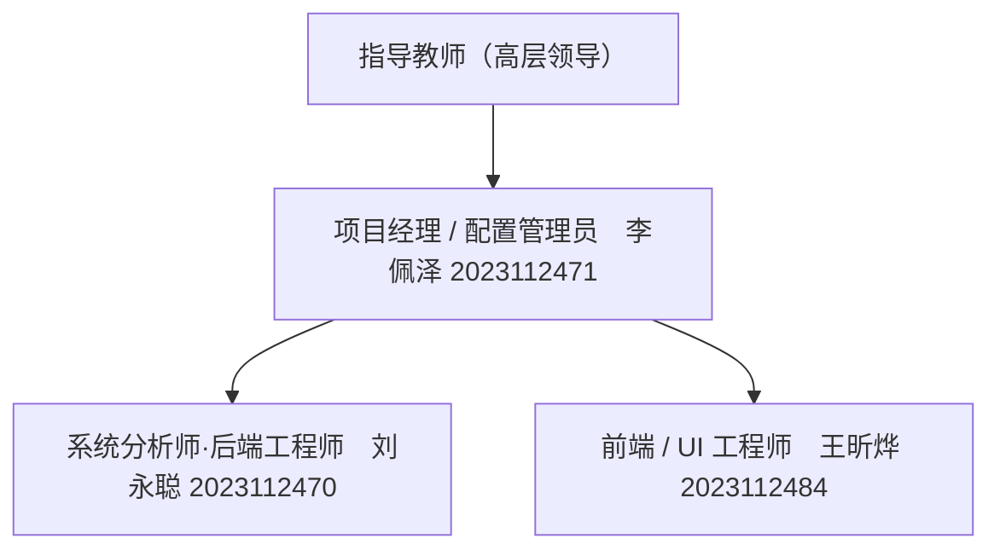
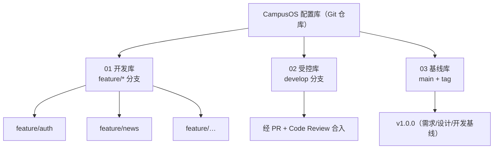
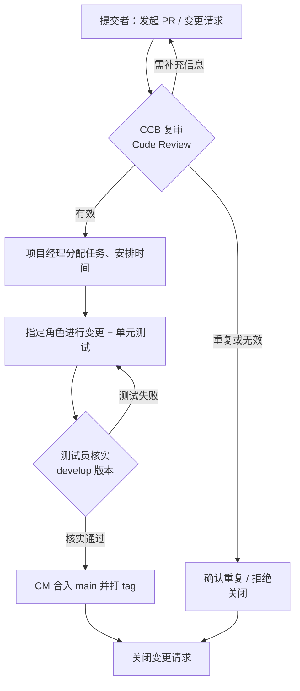
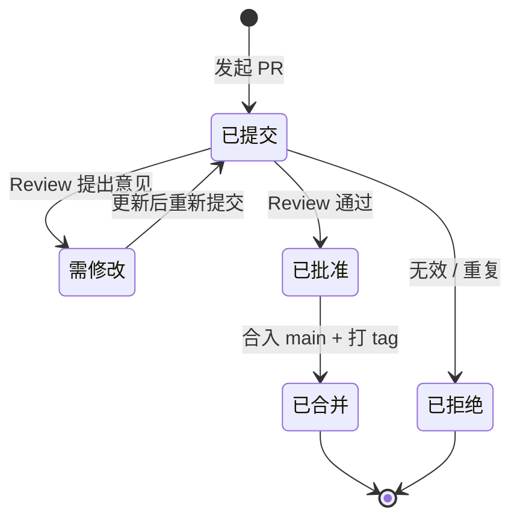

卷    号：________
卷内编号：________
密    级：内部

# CampusOS 高校智慧校园门户系统

## 配置管理计划

**项目编号：** CampusOS-2026-CM-001
**Version：** 1.0

| 项目信息 | 内容 |
| --- | --- |
| 项 目 承 担 部 门 | ＿＿大学 软件工程课程实践 ＿组 |
| 撰 写 人（签名） | 李佩泽 |
| 完 成 日 期 | 2026-07-15 |
| 本文档使用部门 | ■主管领导（指导教师）　■项目组　□客户　■维护人员　□用户 |
| 评审负责人（签名） | 刘永聪 |
| 评 审 日 期 | 2026-07-16 |

> ⚠️ **说明**：日期、项目编号为示例，可按实际调整；人员为本组真实成员（李佩泽 2023112471 项目经理、刘永聪 2023112470 后端工程师、王昕烨 2023112484 前端工程师）。技术内容（配置库结构、工具、流程）已按 CampusOS 项目实际情况编写。

### 文档信息

- **标题：** CampusOS 高校智慧校园门户系统 配置管理计划
- **作者：** 李佩泽
- **创建日期：** 2026-07-10
- **上次更新日期：** 2026-07-16
- **版本：** 1.0.20260716

### 修订文档历史记录

| 日期 | 版本 | 说明 | 作者 |
| --- | --- | --- | --- |
| 2026-07-10 | 0.1.20260710 | 草稿 | 李佩泽 |
| 2026-07-14 | 0.9.20260714 | 补充基于 Git 的配置库结构与权限划分 | 李佩泽 |
| 2026-07-16 | 1.0.20260716 | 评审后正式发布 | 李佩泽 |

---

## 目录

- [1. 简介](#1-简介)
  - [1.1 目的](#11-目的)
  - [1.2 范围](#12-范围)
  - [1.3 定义、首字母缩写词和缩略语](#13-定义首字母缩写词和缩略语)
  - [1.4 参考资料](#14-参考资料)
- [2. 管理](#2-管理)
  - [2.1 组织结构](#21-组织结构)
  - [2.2 工作与职责](#22-工作与职责)
  - [2.3 工具、环境和基础设施](#23-工具环境和基础设施)
- [3. 配置管理活动](#3-配置管理活动)
  - [3.1 配置管理系统](#31-配置管理系统)
  - [3.2 配置标识](#32-配置标识)
  - [3.3 配置项](#33-配置项)
  - [3.4 配置和变更控制](#34-配置和变更控制)
  - [3.5 配置状态统计](#35-配置状态统计)
- [4. 文件归档](#4-文件归档)
- [5. 里程碑](#5-里程碑)

---

## 1. 简介

CampusOS 高校智慧校园门户系统配置管理计划说明在产品生命周期中将执行的所有与配置管理相关的活动。它详细说明了活动时间表、分配的职责以及必需的资源（包括人员、工具和计算机设备）。本项目以 **Git + GitHub（分支模型）** 作为配置管理的核心工具。

### 1.1 目的

明确配置管理对 CampusOS 全周期（开发、测试、运维）的管控价值，保障后端、Web 网站、微信小程序三端代码与工程文档的一致性与可追溯性，提升团队协同效率与项目质量，确保任何一次发布都能被准确地复现与回溯。

### 1.2 范围

- 本规范规定了在制订 CampusOS 软件配置管理计划时应遵循的统一基本要求。
- 适用范围涵盖：后端 `backend/`（Spring Boot 多模块）、网站 `web/`（Vue3）、小程序 `miniapp/`（uni-app）三端源码，数据库脚本 `docs/sql/`，以及全部工程文档。
- 对于第三方依赖（Maven / npm 包），仅纳入版本锁定管理（`pom.xml` / `package-lock.json`），不纳入源码变更控制。

### 1.3 定义、首字母缩写词和缩略语

| 缩写 | 全称 | 含义 |
| --- | --- | --- |
| CCB | Configuration Control Board | 变更（配置）控制委员会 |
| CI | Configuration Item | 配置项 |
| CM | Configuration Management | 配置管理 |
| CMP | Configuration Management Plan | 配置管理计划 |
| CR | Change Request | 变更请求 |
| PM | Project Manager | 项目经理 |
| SA | System Analyst | 系统分析师/架构师 |
| SE | Software Engineer | 软件工程师 |
| TE | Test Engineer | 测试工程师 |
| PPQA | Product and Process Quality Assurance | 产品与过程质量保证 |
| PR | Pull Request | GitHub 合并请求（本项目变更审批载体） |
| DDD | Domain-Driven Design | 领域驱动设计（后端架构风格） |

### 1.4 参考资料

- 《CampusOS README》（项目根目录 `README.md`）
- 《CampusOS 贡献指南》（`docs/贡献指南.md`）
- 《CampusOS 新增功能指南》（`docs/新增功能指南.md`）
- 《CampusOS 软件需求规约》
- 《CampusOS 系统架构设计说明书》
- 《CampusOS 数据库设计说明书》
- 《CampusOS API 接口文档》（项目根目录 `接口文档.md`）

---

## 2. 管理

### 2.1 组织结构

- 高层领导——指导教师（课程验收）
- 项目经理——李佩泽
- 各功能模块开发——各组员
- 一人可兼任多个角色（课程小组规模，角色兼任为常态）



### 2.2 工作与职责

| 角色 | 相关人员 | 职责 | 接口 |
| --- | --- | --- | --- |
| CCB | 李佩泽、刘永聪、王昕烨 | 监督变更流程，由项目组全体成员组成，负责审批对基线（main 分支）的变更。 | 任意角色提出 PR/变更请求后由 CCB 复审、合并或驳回。 |
| 配置经理（CM） | 李佩泽 | 维护 Git 仓库与分支模型、GitHub 权限、`.gitignore`、发布打 tag；撰写 CM 计划并汇报基于 PR 的进度统计。 | 与 PM：提供配置状态报告；与 SE：管理受控/基线分支的合并。 |
| 项目经理（PM） | 李佩泽 | 分配任务、审定里程碑、决定何时打基线。 | 与全体：任务分配与进度跟踪。 |
| 软件工程师（SE） | 刘永聪、王昕烨 | 在功能分支上开发，自测后提 PR。 | 与 CM：通过 PR 提交受控内容。 |
| 测试工程师（TE） | 王昕烨 | 对合并到 develop 的功能执行测试，回报缺陷。 | 与 SE：提交缺陷单。 |
| 任意角色 | 项目组所有成员 | 任何成员均可 checkout/commit 与自己相关的工件，并可提交变更请求。 | — |

### 2.3 工具、环境和基础设施

| 用途 | 工具 |
| --- | --- |
| 版本控制 | Git |
| 远程仓库 / 变更审批 | GitHub（Pull Request + Code Review） |
| 构建 | 后端 Maven 3.8+；前端 npm + Vite |
| 容器化环境 | Docker Desktop + docker compose（一键起 MySQL/Redis/后端/网站） |
| 数据库 | MySQL 8.0（脚本纳入 `docs/sql/`，版本化管理） |
| 依赖锁定 | `pom.xml`（后端）、`package-lock.json`（前端） |
| 文档 | Markdown（随源码一起进仓库，与代码同步版本化） |

---

## 3. 配置管理活动

### 3.1 配置管理系统

#### 3.1.1 配置库结构

本项目以 **Git 仓库 + 分支** 实现「开发库 / 受控库 / 基线库」三级结构：

| 逻辑库 | 对应 Git 载体 | 说明 |
| --- | --- | --- |
| 开发库 | 各功能分支 `feature/模块名`（如 `feature/auth`、`feature/news`） | 开发人员自由提交，无需评审 |
| 受控库 | `develop` 分支 | 功能自测通过后经 PR 合入，受 Code Review 控制 |
| 基线库 | `main` 分支 + 版本 tag（如 `v1.0.0`） | 稳定可发布版本，仅 CM/PM 有权合入与打 tag |

配置库结构图：



仓库目录结构（配置项分布）：

```
CampusOS/
├── backend/         后端源码（campus-common/domain/application/infrastructure/api 五模块）
├── web/             网站端源码
├── miniapp/         小程序端源码
├── docs/sql/        数据库脚本（001_init.sql 起，按编号递增）
├── docs/            团队文档
├── 工程文档-项目版/   课程工程文档（本系列文档）
├── docker-compose.yml
└── README.md
```

#### 3.1.2 配置库的权限划分

| 角色 | feature 分支 | develop 分支 | main 分支 + tag |
| --- | --- | --- | --- |
| PM（李佩泽） | 读写 | 读写（可合并 PR） | 读写（可合并、打 tag） |
| CM（李佩泽 兼） | 读写 | 读写（可合并 PR） | 读写（可合并、打 tag） |
| SE（刘永聪、王昕烨） | 读写（自己的分支） | 只读（经 PR 合入） | 只读 |
| TE（王昕烨） | 只读 | 只读 | 只读 |

> GitHub 分支保护规则：`main` 与 `develop` 禁止直接 push，必须经 PR + 至少 1 人 Review 后合并。

#### 3.1.3 配置库的管理层次

- **无需管理、仅需访问控制的配置项**：由开发人员放入开发库（feature 分支），如临时调试代码；
- **需要保存并版本控制的配置项**：由配置管理员纳入受控库（develop），如已完成的功能模块源码；
- **需进行基线级别管理的配置项**：由配置管理员纳入基线库（main + tag），如对外发布/汇报的版本。

### 3.2 配置标识

#### 3.2.1 标识方法

本项目采用的配置项标识方式：**项目英文简称_工件名称**，如 `CampusOS_配置管理计划`。
代码版本通过 Git commit SHA 与 tag 双重标识；发布版本采用语义化版本号 `主版本.次版本.修订号`（如 `v1.0.0`）。

#### 3.2.2 项目基线

在下列时机建立基线：

- 在计划、需求、设计、实现、测试各阶段结束时建立；
- 在各阶段评审完成时建立；
- 由项目经理决定需建立基线时建立。

| 基线号 | 建立时机 |
| --- | --- |
| A001 | 需求基线（软件需求规约评审通过） |
| B001 | 设计基线（架构与数据库设计评审通过） |
| C001 | 开发基线（新闻模块全链路打通，首个可运行版本 `v1.0.0`） |

各阶段内的基线号规则：阶段基线号 + 序号，如设计阶段第三次基线记为 `B003`。

### 3.3 配置项

CampusOS 的主要配置项清单：

| 类别 | 配置项 |
| --- | --- |
| 文档类 | 需求规约、项目开发计划、数据库设计说明书、系统架构设计说明书、测试计划、测试用例、API 接口文档 |
| 后端代码 | `backend/` 五个 Maven 模块源码、`pom.xml`、`application.yml` |
| 前端代码 | `web/` 源码、`miniapp/` 源码、`package.json`/`package-lock.json` |
| 数据库 | `docs/sql/*.sql` 建表与初始化脚本 |
| 构建部署 | `Dockerfile`、`docker-compose.yml`、`nginx.conf` |

### 3.4 配置和变更控制

#### 3.4.1 变更请求的处理和审批

软件配置的变更管理适用于本项目的所有文档和代码。本项目以 **GitHub Pull Request** 作为变更请求（CR）的正式载体，变更流程如下：

| 活动 | 角色 | 内容 |
| --- | --- | --- |
| 提交变更请求 | 提交者（任意组员） | 在功能分支开发完成后发起 PR，描述变更内容与影响范围。 |
| 复审变更请求 | CCB | 通过 Code Review 复审 PR，判断是否为有效、合理的变更。 |
| 确认重复或拒绝 | CCB 代表 | 对重复或无效的 PR 予以关闭，必要时向提交者索取更多信息。 |
| 更新变更请求 | 提交者 | 根据 Review 意见修改代码并更新 PR。 |
| 分配与安排 | 项目经理 | 对通过复审的变更安排合并时间与关联里程碑。 |
| 进行变更 | 指定角色 | 执行变更（含单元测试），完成后标记 PR 可合并。 |
| 核实变更 | 测试员 | 变更合入 develop 后执行测试，核实功能正确。 |
| 核实发布版本 | CM/系统集成员 | 变更进入 main 前最终核实，打 tag 发布后关闭 PR。 |

变更请求状态（对应 GitHub PR 状态）：`Open（已提交）` → `Changes Requested（需修改）` → `Approved（已批准）` → `Merged（已合并）` / `Closed（已拒绝）`。

变更申请处理流程（活动图）：



变更请求状态图（状态图）：



#### 3.4.2 变更控制委员会（CCB）

- **职责**：明确产品基线、复审对基线的变更、最后批准或否决变更。
- **成员**：项目组全体成员。
- **CCB 主席**：李佩泽。
- **工作方式**：以事件触发（有 PR 即触发 Review）为主，并在每个阶段结束时召开例会确认基线。

### 3.5 配置状态统计

#### 3.5.1 项目介质存储和发布进程

- **备份机制**：代码托管于 GitHub 远程仓库，每次 push 即为一次异地备份；本地成员各自持有完整仓库副本。
- **发布进程**：

| 标识 | 内容 | 针对对象 |
| --- | --- | --- |
| v0.1 | 需求与设计文档 | 项目组内部 |
| v1.0.0 | 新闻模块全链路可运行版本 | 指导教师 / 演示 |
| v1.x | 后续功能模块逐步合入 | 用户 / 演示 |

#### 3.5.2 报告和审计

- **频率**：每个里程碑进行一次配置状态报告。
- **报告人**：配置管理员。
- **审计内容**：功能审计（核实功能是否符合需求）与物理审计（核实基线 tag 对应的代码为正确版本）。

| 名称 | 描述 |
| --- | --- |
| 配置管理项目清单 | 由 CM 编写并维护配置项清单 |
| 变更申请单 | 以 GitHub PR 记录，含变更说明与 Review 意见 |
| 配置状态报告 | 描述当前各分支/tag 的工作版本状态 |
| 基线审计报告 | 记录基线的功能审计与物理审计结果 |

---

## 4. 文件归档

所有配置项随 Git 仓库统一归档，历史版本通过 `git log` 与 tag 永久保留。文档类工件以 Markdown 形式与源码同仓库存放，保证文档与代码版本同步。参见《CampusOS 贡献指南》中的分支与提交规范。

---

## 5. 里程碑

| 里程碑 | 计划时间 | 标志 |
| --- | --- | --- |
| M1 需求基线 | 2026-07-11 | 需求规约评审通过 |
| M2 设计基线 | 2026-07-14 | 架构 + 数据库设计评审通过 |
| M3 开发基线 | 2026-07-16 | 新闻模块全链路打通，发布 `v1.0.0` |
| M4 测试完成 | 2026-07-18 | 系统测试通过，缺陷修复达标 |
| M5 项目结项 | 2026-07-20 | 文档齐套、答辩验收 |

> 在需求确定及项目完成时分别建立里程碑基线。
