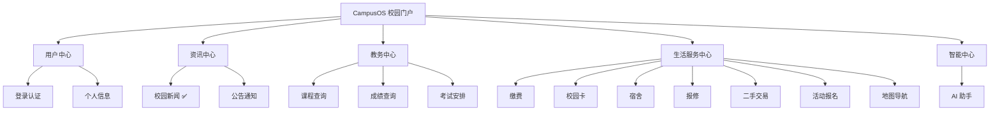
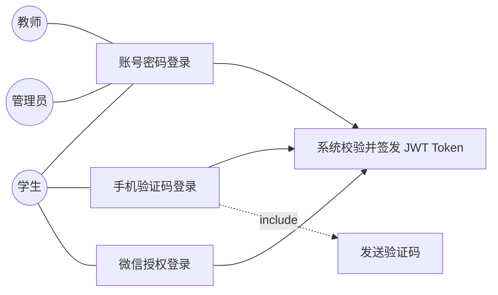

卷    号：________
卷内编号：________
密    级：内部

# CampusOS 高校智慧校园门户系统

**项目编号：** CampusOS-2026-SR-002
**分类：** 使用者：指导教师、项目经理、项目组成员

## 软件需求规约

**Version：** 1.0

| 项目信息 | 内容 |
| --- | --- |
| 项 目 承 担 部 门 | ＿＿大学 软件工程课程实践 ＿组 |
| 撰 写 人（签名） | 刘永聪 |
| 完 成 日 期 | 2026-07-11 |
| 本文档使用部门 | ■主管领导　■项目组　■客户　■维护人员　■用户 |
| 评审负责人（签名） | 李佩泽 |
| 评 审 日 期 | 2026-07-11 |

> ⚠️ **说明**：文档中的日期、项目编号为示例，可按实际调整；人员为本组真实成员（李佩泽 2023112471 项目经理、刘永聪 2023112470 后端工程师、王昕烨 2023112484 前端工程师）。功能、性能、接口等需求内容按 CampusOS 项目实际编写。

### 文档信息

- **标题：** CampusOS 高校智慧校园门户系统 软件需求规约
- **作者：** 刘永聪
- **创建日期：** 2026-07-09
- **上次更新日期：** 2026-07-11
- **版本：** Build1.0
- **部门名称：** ＿＿大学软件工程 ＿组

### 修订文档历史记录

| 日期 | 版本 | 说明 | 作者 |
| --- | --- | --- | --- |
| 2026-07-09 | 0.1.20260709 | 确定 15 个功能模块基本需求 | 刘永聪 |
| 2026-07-10 | Build0.9 | 补充三端（网站/小程序/后端）支持范围与非功能需求 | 刘永聪 |
| 2026-07-11 | Build1.0 | 评审后正式发布 | 刘永聪 |

---

## 目录

- [1. 引言](#1-引言)
  - [1.1 目的](#11-目的)
  - [1.2 范围](#12-范围)
  - [1.3 定义、首字母缩写词和缩略语](#13-定义首字母缩写词和缩略语)
  - [1.4 参考资料](#14-参考资料)
- [2. 软件总体概述](#2-软件总体概述)
  - [2.1 软件标识](#21-软件标识)
  - [2.2 软件描述](#22-软件描述)
  - [2.3 用户的特点](#23-用户的特点)
  - [2.4 限制与约束](#24-限制与约束)
- [3. 具体需求](#3-具体需求)
- [4. 性能](#4-性能)

---

## 1. 引言

### 1.1 目的

本需求规约旨在明确 CampusOS 高校智慧校园门户系统的功能、性能、接口等方面的需求，为系统开发团队、项目管理者、指导教师以及相关利益者提供清晰的系统需求描述，作为系统设计、开发、测试和验收的依据，确保系统能够满足学生、教师、管理员在校园信息服务场景下的多样化需求，实现"一个门户、三端同构"的一站式校园服务。

### 1.2 范围

本系统面向高校校园场景，为**学生、教师、管理员**三类用户提供统一门户服务，覆盖 15 个功能模块（登录认证、个人信息、校园新闻、公告通知、课程、成绩、考试、缴费、校园卡、宿舍、报修、二手交易、活动报名、地图导航、AI 助手）。系统提供 **Web 网站端**与**微信小程序端**两个用户界面，后端以统一的 REST API（JSON，统一 `Result` 结构）对外服务。本期以**校园新闻资讯模块**作为全链路示例完整实现，其余模块按同一架构模板扩展。

### 1.3 定义、首字母缩写词和缩略语

- **API**：应用程序编程接口（Application Programming Interface），系统间数据交互和功能调用的约定。
- **REST**：一种基于 HTTP 的接口风格，本项目所有后端接口均为 RESTful。
- **JWT**：JSON Web Token，本项目除登录注册外接口的认证凭证。
- **DDD**：领域驱动设计，后端采用的分层架构风格（洋葱架构）。
- **SPA**：单页应用，网站端形态。
- **HTTP**：超文本传输协议。
- **JSON**：轻量级数据交换格式，接口统一响应格式。

### 1.4 参考资料

- 《CampusOS README》《CampusOS 15 大功能模块说明》
- 《CampusOS API 接口文档 v1.0》
- 《CampusOS 系统架构设计说明书》《CampusOS 数据库设计说明书》
- 《高校智慧校园建设参考规范》

---

## 2. 软件总体概述

本文档主要定义了 CampusOS 高校智慧校园门户系统的需求。系统由 15 个功能模块组成，按业务域可归为四大中心：**用户中心**（登录认证、个人信息）、**新闻资讯中心**（校园新闻、公告通知）、**教务中心**（课程、成绩、考试）、**生活服务中心**（缴费、校园卡、宿舍、报修、二手交易、活动、地图、AI 助手）。

### 2.1 软件标识

- **软件全名称：** CampusOS 高校智慧校园门户系统
- **软件缩称：** CampusOS
- **版本号：** 1.0

### 2.2 软件描述

#### 2.2.1 系统属性

本系统是基于互联网技术开发的综合性校园服务平台，以 **Web 应用**和**微信小程序**为载体，后端采用 Spring Boot 微服务化的 DDD 分层架构，数据存储采用 MySQL（Redis 预留缓存），为学生、教师提供便捷的校园信息服务，同时为管理员提供内容管理支持。

#### 2.2.2 开发背景

高校学生日常需要在多个分散的系统（教务、一卡通、后勤、图书馆等）之间切换，信息入口分散、体验割裂。为提升校园信息服务的统一性与便捷性，打造集"资讯、教务、生活服务、智能助手"于一体的一站式校园门户十分必要。CampusOS 作为课程实践项目，以工程化、可扩展的三端同构架构，示范一套可持续扩展的智慧校园门户实现方案。

#### 2.2.3 软件功能

系统分为 15 个功能模块：

| # | 模块 | 核心功能 | 支持端 |
| --- | --- | --- | --- |
| 1 | 用户登录与统一认证 | 账号密码/手机验证码/微信授权登录、注册、找回密码、JWT 鉴权 | 网站 + 小程序 |
| 2 | 个人信息中心 | 查看/修改资料、头像、学籍/教师档案、实名认证、改密 | 网站 + 小程序 |
| 3 | 校园新闻资讯 ✅ | 新闻浏览、栏目分类、搜索、收藏分享、后台发布管理 | 网站 + 小程序 |
| 4 | 校园公告通知 | 学校/院系通知发布、已读统计、未读提醒 | 网站 + 小程序 |
| 5 | 课程查询 | 个人课表、今日课程、空闲教室、教师授课查询 | 网站 + 小程序 |
| 6 | 成绩查询 | 成绩列表、GPA 计算、成绩统计分析 | 网站 + 小程序 |
| 7 | 考试安排 | 考试时间/地点/座位查询、考试日历、提醒 | 网站 + 小程序 |
| 8 | 校园缴费 | 学费/电费/网费缴纳与充值、缴费记录（微信/支付宝） | 网站 + 小程序 |
| 9 | 校园卡服务 | 余额与消费记录查询、挂失/解挂、充值 | 网站 + 小程序 |
| 10 | 宿舍管理 | 宿舍信息、成员、水电余额、宿舍公告 | 网站 + 小程序 |
| 11 | 校园报修 | 提交报修（附图）、进度查询、服务评价 | 网站 + 小程序 |
| 12 | 二手交易 | 发布/浏览闲置、搜索筛选、收藏、下单沟通 | 网站 + 小程序 |
| 13 | 校园活动报名 | 活动展示、报名/取消、签到、我的活动 | 网站 + 小程序 |
| 14 | 校园地图导航 | 地点列表、地点详情、搜索、路径规划 | 网站 + 小程序 |
| 15 | AI 智慧校园助手 | AI 问答、办事流程查询、智能推荐 | 网站 + 小程序 |

> ✅ 标记的校园新闻资讯模块为本期已完整实现的全链路示例。

软件功能结构图：

### 2.3 用户的特点

- **学生**：系统主要用户，熟悉移动互联网，高频使用课表、成绩、校园卡、二手、活动等模块，偏好小程序端的便捷操作。
- **教师**：查看授课信息、发布/管理与教学相关内容，个人档案维护，对稳定性和信息准确性要求高。
- **管理员**：负责新闻/公告发布、内容审核、用户与资源管理，主要使用网站后台管理端，需要高效的批量操作与查询能力。

### 2.4 限制与约束

**系统运行环境**

| 类别 | 要求 |
| --- | --- |
| 后端 | Java 17、Spring Boot 3.2、MyBatis-Plus、Maven 3.8+ |
| 数据库 | MySQL 8.0（Redis 6.2+ 预留缓存） |
| 网站端 | Vue 3.5+、TypeScript、Vite、Element Plus、Pinia、Node 18+ |
| 小程序端 | uni-app（Vue3）、微信开发者工具、HBuilderX |
| 部署 | Docker Desktop + docker compose（一键起全套） |

**硬件限制（最低）**

- WEB/数据库服务器：CPU 2 核、内存 4GB、硬盘 40GB；网络以太网 100M。
- 用户机器：现代浏览器（Chrome/Edge/Firefox）或微信客户端即可。

---

## 3. 具体需求

> 各模块接口细节详见《CampusOS API 接口文档》；此处描述功能性需求。

### 3.1 用户登录与统一认证

用户在登录页输入学号/工号/用户名与密码（或手机号 + 验证码）登录；小程序端支持微信授权一键登录。系统校验通过后签发 JWT Token，前端携带 Token 访问受保护接口；Token 过期支持刷新。未通过校验时返回相应错误提示（如账号不存在、密码错误、验证码失效），直至通过。管理员账号可进入后台管理。相关接口：`POST /auth/login`、`/auth/login/sms`、`/auth/login/wechat`、`/auth/register`、`/auth/logout`、`/auth/refresh`。

用户登录用例图：

### 3.2 个人信息中心

用户查看个人资料（姓名、学院、专业、班级、学号/工号等），修改联系方式与头像；学生可查看学籍信息，教师可查看个人档案；支持实名认证与修改密码。相关接口：`GET/PUT /user/profile`、`POST /user/avatar`、`GET /user/profile/student|teacher`、`POST /user/verify`、`PUT /user/password`。

### 3.3 校园新闻资讯（本期已实现）

- **浏览**：分页展示已发布新闻，支持按栏目（校园新闻/学院动态/通知公告/政策文件）筛选与关键词搜索；点击查看详情，浏览量自增。
- **收藏分享**：登录用户可收藏/取消收藏新闻，查看收藏列表。
- **后台管理**：管理员发布新闻，支持草稿（DRAFT）/已发布（PUBLISHED）/已下线（OFFLINE）状态流转，前台仅展示已发布内容。
- 相关接口：`GET /news/list`、`GET /news/detail/{id}`、`GET /news/categories`、`POST/DELETE /news/favorite/{id}`、`POST /admin/news`。

### 3.4 校园公告通知

发布学校/院系通知，支持紧急通知推送；用户可标记已读，系统统计阅读状态并提示未读数量。接口：`GET /notice/list`、`/notice/detail/{id}`、`POST /notice/read/{id}`、`GET /notice/unread/count`。

### 3.5 课程查询

学生查看个人课表（按学期/周次）、今日课程提醒；查询空闲教室、教师授课列表。接口：`GET /course/schedule`、`/course/today`、`/course/free-classrooms`、`/course/teacher/{teacherId}`。

### 3.6 成绩查询

查询各学期考试/平时成绩、计算 GPA、成绩统计分析。接口：`GET /score/list`、`/score/gpa`、`/score/statistics`。

### 3.7 考试安排

查询考试时间、地点、考场座位；按月获取考试日历；考试提醒。接口：`GET /exam/list`、`/exam/calendar`。

### 3.8 校园缴费

查看待缴费项目（学费/电费/网费），创建缴费订单（微信/支付宝），查询缴费记录，宿舍电费充值。接口：`GET /payment/pending`、`POST /payment/order`、`GET /payment/records`、`POST /payment/electricity`。

### 3.9 校园卡服务

查询校园卡余额与消费记录，挂失/解挂，充值。接口：`GET /card/info`、`/card/transactions`、`POST /card/loss`、`/card/unloss`、`/card/recharge`。

### 3.10 宿舍管理

查看宿舍信息（楼栋/房间/成员/设施）、水电余额、宿舍公告。接口：`GET /dormitory/info`、`/dormitory/notice`、`/dormitory/utility`。

### 3.11 校园报修

提交报修申请（类型、描述、上传图片、联系方式），查看报修列表与进度，完成后评价维修服务。流程：学生提交 → 维修人员接单 → 处理中 → 完成 → 评价。接口：`POST /repair/submit`、`GET /repair/list`、`/repair/detail/{id}`、`POST /repair/evaluate`。

### 3.12 二手交易

发布闲置商品（标题/价格/描述/图片/联系方式），按分类/关键词/价格筛选浏览，收藏商品，创建订单与卖家沟通。接口：`GET /product/list`、`/product/detail/{id}`、`POST /product`、`/product/favorite/{id}`、`/product/order`。

### 3.13 校园活动报名

浏览活动（体育/文艺/学术/志愿），在线报名/取消，活动签到，查看我的活动。接口：`GET /activity/list`、`/activity/detail/{id}`、`POST /activity/register`、`DELETE /activity/register/{id}`、`POST /activity/checkin`、`GET /activity/my`。

### 3.14 校园地图与导航

查看校园地点列表（教学楼/图书馆/食堂/宿舍/体育馆）与详情，搜索地点，路径规划（步行/公交/驾车）。接口：`GET /location/list`、`/location/detail/{id}`、`/location/search`、`POST /location/route`。

### 3.15 AI 智慧校园助手

AI 问答（支持多轮上下文）、办事流程查询、智能推荐（课程/活动/食堂）、热门问题。接口：`POST /ai/chat`、`GET /ai/hot-questions`、`POST /ai/process`、`GET /ai/recommend`。

---

## 4. 性能

- **响应时间**：核心查询接口响应时间 ≤ 3 秒，页面首屏加载 ≤ 2 秒，新闻列表等高频接口 ≤ 500ms。
- **并发**：支持校园场景日常并发（设计目标日活 1 万级，峰值并发 500+）。
- **兼容性**：网站端兼容 Chrome/Edge/Firefox 主流浏览器；小程序端兼容 iOS/Android 微信客户端。
- **安全性**：除登录/注册及部分公开查询外，所有接口需 JWT 鉴权；密码加密存储；敏感操作（改密、缴费）二次校验。
- **可用性**：界面简洁直观，学生端核心操作步骤 ≤ 3 步；接口统一 `Result{code,msg,data}` 结构，错误可读。
