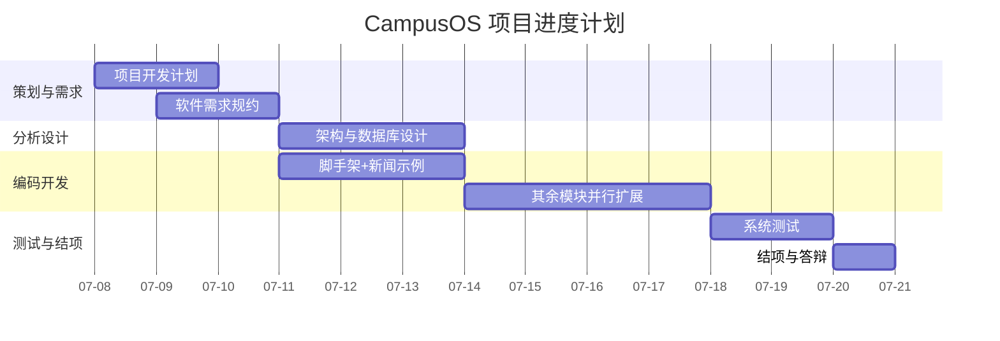

卷    号：________
卷内编号：________
密    级：内部

# CampusOS 高校智慧校园门户系统

## 项目开发计划

**项目编号：** CampusOS-2026-PP-003
**Version：** 1.0

| 项目信息 | 内容 |
| --- | --- |
| 项 目 承 担 部 门 | ＿＿大学 软件工程课程实践 ＿组 |
| 撰 写 人（签名） | 李佩泽 |
| 完 成 日 期 | 2026-07-10 |
| 本文档使用部门 | ■主管领导　■项目组　■客户　□维护人员　□用户 |
| 评审负责人（签名） | 刘永聪 |
| 评 审 日 期 | 2026-07-10 |

> ⚠️ **说明**：日期、项目编号为示例，可按实际调整；人员为本组真实成员（李佩泽 2023112471 项目经理、刘永聪 2023112470 后端工程师、王昕烨 2023112484 前端工程师）。

### 文档信息

- **标题：** CampusOS 高校智慧校园门户系统 项目开发计划
- **作者：** 李佩泽
- **创建日期：** 2026-07-09
- **上次更新日期：** 2026-07-10
- **版本：** 1.0.20260710
- **部门名称：** ＿＿大学软件工程 ＿组

### 修订文档历史记录

| 日期 | 版本 | 说明 | 作者 |
| --- | --- | --- | --- |
| 2026-07-08 | 0.1.20260708 | 草稿 | 李佩泽 |
| 2026-07-10 | 1.0.20260710 | 后台管理功能细分为多模块，按模块分工排期；评审后正式发布 | 李佩泽 |

---

## 目录

- [1. 前言](#1-前言)
- [2. 项目概述](#2-项目概述)
- [3. 角色和职责](#3-角色和职责)
- [4. 项目的已定义过程](#4-项目的已定义过程)
- [5. 工作任务分解](#5-工作任务分解)
- [6. 项目估计](#6-项目估计)
- [7. 项目所需技能和培训计划](#7-项目所需技能和培训计划)
- [8. 项目相关计划](#8-项目相关计划)
- [9. 开发计划](#9-开发计划)
- [10. 工作环境](#10-工作环境)

---

## 1. 前言

CampusOS 高校智慧校园门户系统是一套"Spring Boot 后端 + Vue3 网站 + 微信小程序"三端同构的校园门户，为学生、教师、管理员提供资讯、教务、生活服务、智能助手的一站式服务。本项目以校园新闻模块作为全链路示例，其余模块由团队成员照同一架构模板扩展。

### 1.1 目的

本计划应用于项目《CampusOS 高校智慧校园门户系统》开发的整个生命周期，规范项目的组织、过程、进度、质量、配置与风险管理。

### 1.2 术语与缩略语

| 缩写 | 含义 |
| --- | --- |
| PPQA | 过程和产品质量保证 |
| CM | 配置管理 |
| SPP | 软件开发计划 |
| PM | 项目经理 |
| RUP | 统一软件开发过程 |
| CCB | 变更控制委员会 |
| DDD | 领域驱动设计 |

---

## 2. 项目概述

### 2.1 项目背景和目标

高校信息服务系统分散、体验割裂，学生需在多个系统间切换。为提升校园信息服务的统一性与便捷性，构建整合资讯、教务、生活服务、AI 助手的 CampusOS 门户十分必要。

**目标**：开发一套架构清晰、可持续扩展、三端同构的校园门户，包含 15 个功能模块；以新闻模块打通"后端四层 → 网站 → 小程序"全链路作为示范；确保系统在性能、安全性、稳定性方面满足校园日常使用需求，并形成一套可复用的功能扩展规范（新增功能指南）。

### 2.2 项目范围

涵盖 15 个功能模块的需求、设计、编码、测试全过程，包括网站端与微信小程序端两个前端、Spring Boot 后端与 MySQL 数据库；本期完整交付新闻模块，其余模块提供架构模板与接口约定。不含真实第三方系统（教务、一卡通、支付、AI 大模型）的对接实现，相关模块以接口约定与模拟数据示范。

### 2.3 交付的产品

| 所属阶段 | 交付工件名称 | 工件类型 | 预定交付日期 |
| --- | --- | --- | --- |
| 项目策划 | 项目开发计划 | Markdown/Word 文档 | 2026-07-10 |
| 需求分析 | 软件需求规约 | 文档 | 2026-07-11 |
| 分析设计 | 系统架构设计说明书 | 文档 | 2026-07-14 |
| 分析设计 | 数据库设计说明书 | 文档 | 2026-07-14 |
| 编码测试 | 软件代码工程（三端源码） | 源代码 | 2026-07-16 |
| 系统测试 | 测试计划、测试用例、测试报告 | 文档 | 2026-07-18 |
| 项目结项 | 可发布工件 + 安装使用手册 + 开发总结 | 工件/文档 | 2026-07-20 |
| 整个过程 | 项目阶段评审报告、例会纪要 | 文档 | 2026-07-20 |

### 2.4 约束和假设

- 根据课程要求，本项目于 2026-07-20 前完成。
- 假设项目组核心成员在项目周期内稳定，不中途退出；开发环境（Docker、JDK17、Node18）可正常搭建。

---

## 3. 角色和职责

### 3.1 利益相关人角色和职责

| 姓名 | 角色 | 在项目中作用 |
| --- | --- | --- |
| 李佩泽 2023112471 | 项目经理 / 配置管理员 | 项目管理、进度监督与控制、后端核心开发、配置管理 |
| 刘永聪 2023112470 | 系统分析师 / 架构师 · 后端工程师 | 需求分析、系统架构与数据库设计、后端模块编码与单元测试 |
| 王昕烨 2023112484 | 前端 / UI 工程师 · 测试 | 网站端与小程序端开发、界面设计、测试用例设计与执行 |

### 3.2 有关的利益相关人介入计划

| 相关部门 | 相关角色 | 相关人员 |
| --- | --- | --- |
| 资源保障 / 主管 | 指导教师 | 指导教师 |
| 项目管理 | PM | 李佩泽 |
| 质量保证 | PPQA 检查员 | 刘永聪 |
| 测试 | 测试经理 | 王昕烨 |
| 架构 | 系统架构师 | 刘永聪 |

---

## 4. 项目的已定义过程

### 4.1 项目的生命周期选择

本项目采用 **RUP（统一软件开发过程）** 的裁剪版本，结合敏捷迭代：以模块为迭代单元，先打通新闻模块全链路，再并行扩展其余模块。

### 4.2 项目阶段划分及主要工作产品

| 所属阶段 | 交付工件 | 类型 | 预定交付日期 |
| --- | --- | --- | --- |
| 项目策划 | 项目开发计划 | 文档 | 2026-07-10 |
| 需求分析 | 软件需求规约 | 文档 | 2026-07-11 |
| 分析设计 | 架构设计、数据库设计说明书 | 文档 | 2026-07-14 |
| 编码测试 | 三端源码 | 源代码 | 2026-07-16 |
| 系统测试 | 测试报告 | 文档 | 2026-07-18 |
| 项目结项 | 可发布工件、总结报告 | 工件/文档 | 2026-07-20 |

### 4.3 本项目采用的过程

| 过程域 | 采用的过程 |
| --- | --- |
| 工程（Engineering） | 需求开发（RD）、需求管理（REQM）、技术解决方案（TS）、产品集成（PI）、验证（VER）、确认（VAL） |
| 项目管理（Project Manage） | 项目策划（PP）、项目监督与控制（PMC）、风险管理（RSKM） |
| 支持（Support） | 配置管理（CM）、过程和产品质量保证（PPQA）、度量与分析（MA） |

### 4.4 裁剪结论

本项目为课程实践、团队规模小、周期短，采用生命周期阶段裁剪方式：合并部分评审环节，用 GitHub PR + Code Review 替代重量级 CCB 会议，度量与分析简化为每周进度与缺陷统计。

---

## 5. 工作任务分解

以功能模块为任务分解单元，见下表（详细进度见《CampusOS 项目进度计划》/GitHub Issues）：

| 任务 | 负责人 | 说明 |
| --- | --- | --- |
| 项目脚手架 + DDD 分层骨架 | 李佩泽/刘永聪 | Maven 多模块、Docker、通用 Result/异常 |
| 新闻模块全链路（示例） | 李佩泽 | 后端四层 + 网站浏览/管理 + 小程序浏览 |
| 登录认证模块 | 刘永聪 | JWT、多种登录方式 |
| 个人信息 / 教务类模块 | 刘永聪/王昕烨 | 个人信息、课程、成绩、考试 |
| 生活服务类模块 | 王昕烨 | 缴费、校园卡、宿舍、报修、二手、活动、地图 |
| AI 助手模块 | 刘永聪 | AI 问答、推荐 |
| 测试与文档 | 王昕烨 | 用例、测试、工程文档 |

## 6. 项目估计

- 团队规模：5 人；项目周期：约 2 周（2026-07-08 ~ 2026-07-20）。
- 工作量估算：新闻示例模块约 3 人日；其余模块按架构模板复制，单模块 1~2 人日；文档与测试约 4 人日。
- 关键路径：脚手架 → 新闻全链路示例 → 其余模块并行扩展 → 系统测试 → 结项。

项目进度甘特图：

---

## 7. 项目所需技能和培训计划

### 7.1 项目所需技能

| 角色 | 预计人数 | 到位时间 | 技能/经验 |
| --- | --- | --- | --- |
| 项目经理 · 配置管理 | 1 | 2026-07-08 | 项目管理、Java 后端开发经验 |
| 系统分析师/架构师 · 后端工程师 | 1 | 2026-07-08 | DDD 分层、MySQL 建模、UML 建模、Java 17、Spring Boot、MyBatis-Plus |
| 前端/UI 工程师 · 测试 | 1 | 2026-07-09 | Vue3 + TS、Element Plus、uni-app、黑盒测试与用例设计 |

### 7.2 项目组成员掌握技能情况

| 姓名 | 角色 | 是否满足技能要求 |
| --- | --- | --- |
| 李佩泽 2023112471 | 项目经理 / 配置管理 | 是 |
| 刘永聪 2023112470 | 系统分析师/架构师 · 后端 | 是 |
| 王昕烨 2023112484 | 前端/UI 工程师 · 测试 | 是（测试工具边做边熟悉） |

### 7.3 项目培训计划

| 培训时间 | 培训内容 | 培训方式 | 参加人员 |
| --- | --- | --- | --- |
| 2026-07-08 | DDD 洋葱架构与项目分层规范（照新闻模块讲解） | 案例演示 | 全体 |
| 2026-07-09 | Vue3 + uni-app 三端接口约定与 request 封装 | 案例演示 | 前端相关 |

---

## 8. 项目相关计划

见本文档第 9 节各子计划，以及《CampusOS 配置管理计划书》《CampusOS 测试计划》。

---

## 9. 开发计划

### 9.1 项目监控计划

#### 9.1.1 活动安排

- 每周（或每两日）对项目的规模、进度、质量、风险进行跟踪、评审；
- 机制：每日各成员在 GitHub Issues/看板更新任务状态；每周项目经理汇总进度并召开例会，产出《项目例会纪要》；
- 项目完成后由项目经理编写《项目开发总结报告》。

#### 9.1.2 偏差控制（项目计划变更与重估计约定）

| 监控参数 | 控制值 | 行动 |
| --- | --- | --- |
| 工作量 | 阈值 20% / 预警值 15% | 度量分析，超阈值经 CCB 讨论后重估计 |
| 进度 | 阈值 15% / 预警值 10% | 度量分析，调整任务分配 |

### 9.2 风险管理计划

| 风险 | 应对 |
| --- | --- |
| 成员对 DDD/三端技术栈不熟 | 以新闻模块为模板 + 新增功能指南降低上手成本 |
| 第三方能力（支付/AI）不可用 | 以接口约定 + 模拟数据示范，不阻塞主流程 |
| 环境搭建困难 | 提供 Docker 一键启动方案 |
| 进度延误 | 优先保证新闻示例 + 核心模块，其余可裁剪 |

### 9.3 度量与分析计划

以周为单位统计：已合并 PR 数、完成模块数、缺陷数与修复率，作为进度与质量度量依据。

### 9.4 质量保证计划

遵循《贡献指南》各层职责红线；提 PR 前自检；由 PPQA（刘永聪）抽查代码规范与文档一致性。

### 9.5 配置管理计划

见《CampusOS 配置管理计划书》，以 Git + GitHub PR 实现三级配置库与变更控制。

### 9.6 系统测试计划

见《CampusOS 测试计划》，系统测试阶段含功能、性能、兼容性测试。

### 9.7 介入计划

见第 3.2 节利益相关人介入计划。

### 9.8 数据管理计划

数据库脚本纳入 `docs/sql/` 版本管理；示例数据随 `001_init.sql` 提供；生产数据不进仓库。

### 9.9 项目培训计划

见第 7.3 节。

### 9.10 需求管理计划

需求以《软件需求规约》为基线，需求变更走 GitHub Issue + PR，经 CCB 复审后更新基线文档。

---

## 10. 工作环境

### 10.1 开发环境

#### 10.1.1 硬件设备

开发用个人电脑（内存 ≥ 8GB，可运行 Docker Desktop）。

#### 10.1.2 支持工具和软件环境

JDK 17、Maven 3.8+、Node 18+、Docker Desktop、IntelliJ IDEA、VS Code、HBuilderX、微信开发者工具、Git/GitHub、MySQL 8.0。

### 10.2 测试环境

#### 10.2.1 硬件设备

与开发环境一致，或统一 Docker 容器环境。

#### 10.2.2 支持工具和软件环境

Docker compose 一键起 MySQL/Redis/后端/网站；浏览器（Chrome/Edge/Firefox）；微信开发者工具；接口测试用 Postman/Apifox。
