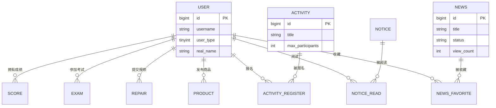

卷    号：________
卷内编号：________
密    级：内部

# CampusOS 高校智慧校园门户系统

## 数据库设计说明书

**项目编号：** CampusOS-2026-DB-004
**Version：** 1.0

| 项目信息 | 内容 |
| --- | --- |
| 项目承担部门 | ＿＿大学 软件工程课程实践 ＿组 |
| 撰 写 人 | 刘永聪 |
| 完 成 日 期 | 2026-07-14 |
| 本文档使用部门 | 项目组　维护人员 |
| 评审负责人 | 李佩泽 |
| 评 审 日 期 | 2026-07-14 |

> ⚠️ **说明**：日期、项目编号为示例，可按实际调整；人员为本组真实成员（李佩泽 2023112471、刘永聪 2023112470、王昕烨 2023112484）。表结构中 `t_news` 与项目 `docs/sql/001_init.sql` 完全一致（已实现）；其余表为按《API 接口文档》字段设计的规划表结构。

### 文档信息

- **标题：** CampusOS 高校智慧校园门户系统 数据库设计说明书
- **作者：** 刘永聪
- **创建日期：** 2026-07-12
- **上次更新日期：** 2026-07-14
- **版本：** 1.0.2
- **部门名称：** ＿组

### 修订文档历史记录

| 日期 | 版本 | 说明 | 作者 |
| --- | --- | --- | --- |
| 2026-07-12 | 1.0.1 | 初版：新闻表 t_news 落地 | 刘永聪 |
| 2026-07-14 | 1.0.2 | 补充用户、公告、教务、生活服务类规划表 | 刘永聪 |

---

## 目录

- [1. 引言](#1-引言)
- [2. 外部设计](#2-外部设计)
- [3. 结构设计](#3-结构设计)
- [4. 运用设计](#4-运用设计)

---

## 1. 引言

### 1.1 编写目的

数据库设计说明书根据软件需求规约与概要设计的要求编写，为详细设计与编码提供数据结构标准，供后端开发人员（PO/Mapper 映射）与测试人员使用。

### 1.2 背景

- 使用的数据库管理系统：**MySQL Server 8.0.31**（字符集 utf8mb4）。
- 任务提出者：李佩泽 / 指导教师。
- 用户：学生、教师、管理员。
- 数据库名：`campus_os`。ORM 框架：MyBatis-Plus（驼峰 ↔ 下划线自动映射，逻辑删除 `deleted` 字段）。

### 1.3 定义

- **CDM（Concept Data Model）**：概念数据模型。
- **PDM（Physics Data Model）**：物理数据模型。
- **PO（Persistent Object）**：持久化对象，与数据库表一一对应（如 `NewsPO` ↔ `t_news`）。
- **逻辑删除**：以 `deleted` 字段（0 未删 / 1 已删）标记，不物理删除。

### 1.4 参考资料

《CampusOS 软件需求规约》《CampusOS API 接口文档》《CampusOS README》、`docs/sql/001_init.sql`。

---

## 2. 外部设计

### 2.1 类型划分

- **主表**：约 12 个（用户、新闻、公告、课程、成绩、考试、缴费、校园卡、宿舍、报修、二手商品、活动）。
- **关系/流水表**：若干（新闻收藏、活动报名、消费流水等）。
- 命名规范：所有业务表以 `t_` 前缀命名；主键统一 `id`（BIGINT 自增）；时间字段 `create_time` / `update_time` 由数据库默认值维护。

### 2.2 数据库表设计格式说明

> 格式：字段中文名 ｜ 字段名 ｜ 字段类型 ｜ 不为空 ｜ 主键 ｜ 外键

#### 2.2.1 校园新闻表（t_news）　✅ 已实现

| 字段中文名 | 字段名 | 字段类型 | 不为空 | 主键 | 外键 |
| --- | --- | --- | :---: | :---: | :---: |
| 主键 | id | BIGINT | 是 | 是 | 否 |
| 标题 | title | VARCHAR(200) | 是 | 否 | 否 |
| 正文内容 | content | TEXT | 是 | 否 | 否 |
| 栏目 | category | VARCHAR(50) | 是 | 否 | 否 |
| 封面图 URL | cover_image | VARCHAR(500) | 否 | 否 | 否 |
| 作者/发布人 | author | VARCHAR(50) | 是 | 否 | 否 |
| 状态(DRAFT/PUBLISHED/OFFLINE) | status | VARCHAR(20) | 是 | 否 | 否 |
| 浏览量 | view_count | INT | 是 | 否 | 否 |
| 发布时间 | publish_time | DATETIME | 否 | 否 | 否 |
| 创建时间 | create_time | DATETIME | 是 | 否 | 否 |
| 更新时间 | update_time | DATETIME | 是 | 否 | 否 |
| 逻辑删除(0未删/1已删) | deleted | TINYINT | 是 | 否 | 否 |

> 索引：`idx_status_publish_time(status, publish_time)`、`idx_category(category)`。

#### 2.2.2 用户表（t_user）

| 字段中文名 | 字段名 | 字段类型 | 不为空 | 主键 | 外键 |
| --- | --- | --- | :---: | :---: | :---: |
| 主键 | id | BIGINT | 是 | 是 | 否 |
| 用户名(学号/工号) | username | VARCHAR(50) | 是 | 否 | 否 |
| 密码(加密) | password | VARCHAR(100) | 是 | 否 | 否 |
| 真实姓名 | real_name | VARCHAR(50) | 是 | 否 | 否 |
| 用户类型(1学生/2教师/3管理员) | user_type | TINYINT | 是 | 否 | 否 |
| 性别 | gender | VARCHAR(10) | 否 | 否 | 否 |
| 手机号 | phone | VARCHAR(20) | 否 | 否 | 否 |
| 邮箱 | email | VARCHAR(100) | 否 | 否 | 否 |
| 头像 URL | avatar | VARCHAR(500) | 否 | 否 | 否 |
| 学院 | department | VARCHAR(100) | 否 | 否 | 否 |
| 专业 | major | VARCHAR(100) | 否 | 否 | 否 |
| 班级 | class_name | VARCHAR(50) | 否 | 否 | 否 |
| 学号/工号 | student_id | VARCHAR(50) | 否 | 否 | 否 |
| 入学年份 | enrollment_year | VARCHAR(10) | 否 | 否 | 否 |
| 状态(0正常/1冻结) | status | TINYINT | 是 | 否 | 否 |
| 创建时间 | create_time | DATETIME | 是 | 否 | 否 |
| 逻辑删除 | deleted | TINYINT | 是 | 否 | 否 |

#### 2.2.3 公告表（t_notice）

| 字段中文名 | 字段名 | 字段类型 | 不为空 | 主键 | 外键 |
| --- | --- | --- | :---: | :---: | :---: |
| 主键 | id | BIGINT | 是 | 是 | 否 |
| 标题 | title | VARCHAR(200) | 是 | 否 | 否 |
| 内容 | content | TEXT | 是 | 否 | 否 |
| 类型(SCHOOL学校/DEPT院系) | type | VARCHAR(20) | 是 | 否 | 否 |
| 发布院系 | department | VARCHAR(100) | 否 | 否 | 否 |
| 是否紧急 | is_urgent | TINYINT | 是 | 否 | 否 |
| 发布人 | publisher | VARCHAR(50) | 是 | 否 | 否 |
| 发布时间 | publish_time | DATETIME | 否 | 否 | 否 |
| 创建时间 | create_time | DATETIME | 是 | 否 | 否 |
| 逻辑删除 | deleted | TINYINT | 是 | 否 | 否 |

#### 2.2.4 公告已读表（t_notice_read）

| 字段中文名 | 字段名 | 字段类型 | 不为空 | 主键 | 外键 |
| --- | --- | --- | :---: | :---: | :---: |
| 主键 | id | BIGINT | 是 | 是 | 否 |
| 公告 ID | notice_id | BIGINT | 是 | 否 | 是（t_notice.id） |
| 用户 ID | user_id | BIGINT | 是 | 否 | 是（t_user.id） |
| 阅读时间 | read_time | DATETIME | 是 | 否 | 否 |

#### 2.2.5 课程表（t_course）

| 字段中文名 | 字段名 | 字段类型 | 不为空 | 主键 | 外键 |
| --- | --- | --- | :---: | :---: | :---: |
| 主键 | id | BIGINT | 是 | 是 | 否 |
| 课程名称 | name | VARCHAR(100) | 是 | 否 | 否 |
| 课程代码 | course_code | VARCHAR(30) | 是 | 否 | 否 |
| 授课教师 | teacher | VARCHAR(50) | 是 | 否 | 否 |
| 教学楼 | building | VARCHAR(50) | 否 | 否 | 否 |
| 教室 | classroom | VARCHAR(50) | 否 | 否 | 否 |
| 学期 | semester | VARCHAR(20) | 是 | 否 | 否 |
| 星期(1-7) | day_of_week | TINYINT | 是 | 否 | 否 |
| 时间段 | time_slot | VARCHAR(20) | 是 | 否 | 否 |
| 上课周次 | weeks | VARCHAR(50) | 否 | 否 | 否 |
| 学分 | credit | INT | 否 | 否 | 否 |
| 逻辑删除 | deleted | TINYINT | 是 | 否 | 否 |

#### 2.2.6 成绩表（t_score）

| 字段中文名 | 字段名 | 字段类型 | 不为空 | 主键 | 外键 |
| --- | --- | --- | :---: | :---: | :---: |
| 主键 | id | BIGINT | 是 | 是 | 否 |
| 学生 ID | user_id | BIGINT | 是 | 否 | 是（t_user.id） |
| 课程名称 | course_name | VARCHAR(100) | 是 | 否 | 否 |
| 课程代码 | course_code | VARCHAR(30) | 是 | 否 | 否 |
| 学分 | credit | INT | 是 | 否 | 否 |
| 分数 | score | DECIMAL(5,2) | 是 | 否 | 否 |
| 等级 | grade | VARCHAR(20) | 否 | 否 | 否 |
| 类型(EXAM考试/USUAL平时) | type | VARCHAR(20) | 是 | 否 | 否 |
| 学期 | semester | VARCHAR(20) | 是 | 否 | 否 |
| 考试时间 | exam_time | DATE | 否 | 否 | 否 |

#### 2.2.7 考试安排表（t_exam）

| 字段中文名 | 字段名 | 字段类型 | 不为空 | 主键 | 外键 |
| --- | --- | --- | :---: | :---: | :---: |
| 主键 | id | BIGINT | 是 | 是 | 否 |
| 学生 ID | user_id | BIGINT | 是 | 否 | 是（t_user.id） |
| 课程名称 | course_name | VARCHAR(100) | 是 | 否 | 否 |
| 课程代码 | course_code | VARCHAR(30) | 是 | 否 | 否 |
| 考试日期 | exam_date | DATE | 是 | 否 | 否 |
| 考试时间 | exam_time | VARCHAR(30) | 是 | 否 | 否 |
| 教学楼 | building | VARCHAR(50) | 否 | 否 | 否 |
| 教室 | classroom | VARCHAR(50) | 否 | 否 | 否 |
| 座位号 | seat_number | VARCHAR(10) | 否 | 否 | 否 |
| 状态 | status | VARCHAR(20) | 是 | 否 | 否 |

#### 2.2.8 报修表（t_repair）

| 字段中文名 | 字段名 | 字段类型 | 不为空 | 主键 | 外键 |
| --- | --- | --- | :---: | :---: | :---: |
| 主键 | id | BIGINT | 是 | 是 | 否 |
| 报修人 ID | user_id | BIGINT | 是 | 否 | 是（t_user.id） |
| 类型(水电/家具/设备/网络/其他) | type | VARCHAR(20) | 是 | 否 | 否 |
| 标题 | title | VARCHAR(100) | 是 | 否 | 否 |
| 描述 | description | VARCHAR(1000) | 是 | 否 | 否 |
| 图片(JSON 数组) | images | VARCHAR(1000) | 否 | 否 | 否 |
| 楼栋 | building | VARCHAR(50) | 否 | 否 | 否 |
| 房间 | room | VARCHAR(50) | 否 | 否 | 否 |
| 联系电话 | contact_phone | VARCHAR(20) | 否 | 否 | 否 |
| 状态(待接单/处理中/已完成/已评价) | status | VARCHAR(20) | 是 | 否 | 否 |
| 评分 | score | TINYINT | 否 | 否 | 否 |
| 创建时间 | create_time | DATETIME | 是 | 否 | 否 |

#### 2.2.9 二手商品表（t_product）

| 字段中文名 | 字段名 | 字段类型 | 不为空 | 主键 | 外键 |
| --- | --- | --- | :---: | :---: | :---: |
| 主键 | id | BIGINT | 是 | 是 | 否 |
| 卖家 ID | user_id | BIGINT | 是 | 否 | 是（t_user.id） |
| 标题 | title | VARCHAR(100) | 是 | 否 | 否 |
| 价格 | price | DECIMAL(10,2) | 是 | 否 | 否 |
| 描述 | description | VARCHAR(1000) | 否 | 否 | 否 |
| 分类 | category | VARCHAR(50) | 否 | 否 | 否 |
| 封面图 | cover_image | VARCHAR(500) | 否 | 否 | 否 |
| 状态(0在售/1已售) | status | TINYINT | 是 | 否 | 否 |
| 浏览量 | view_count | INT | 是 | 否 | 否 |
| 联系电话 | contact_phone | VARCHAR(20) | 否 | 否 | 否 |
| 创建时间 | create_time | DATETIME | 是 | 否 | 否 |
| 逻辑删除 | deleted | TINYINT | 是 | 否 | 否 |

#### 2.2.10 活动表（t_activity）

| 字段中文名 | 字段名 | 字段类型 | 不为空 | 主键 | 外键 |
| --- | --- | --- | :---: | :---: | :---: |
| 主键 | id | BIGINT | 是 | 是 | 否 |
| 标题 | title | VARCHAR(100) | 是 | 否 | 否 |
| 分类(体育/文艺/学术/志愿) | category | VARCHAR(20) | 是 | 否 | 否 |
| 封面图 | cover_image | VARCHAR(500) | 否 | 否 | 否 |
| 开始时间 | start_time | DATETIME | 是 | 否 | 否 |
| 结束时间 | end_time | DATETIME | 是 | 否 | 否 |
| 地点 | location | VARCHAR(100) | 是 | 否 | 否 |
| 人数上限 | max_participants | INT | 是 | 否 | 否 |
| 当前报名人数 | current_participants | INT | 是 | 否 | 否 |
| 状态(报名中/进行中/已结束) | status | VARCHAR(20) | 是 | 否 | 否 |
| 逻辑删除 | deleted | TINYINT | 是 | 否 | 否 |

#### 2.2.11 活动报名表（t_activity_register）

| 字段中文名 | 字段名 | 字段类型 | 不为空 | 主键 | 外键 |
| --- | --- | --- | :---: | :---: | :---: |
| 主键 | id | BIGINT | 是 | 是 | 否 |
| 活动 ID | activity_id | BIGINT | 是 | 否 | 是（t_activity.id） |
| 用户 ID | user_id | BIGINT | 是 | 否 | 是（t_user.id） |
| 报名备注 | remark | VARCHAR(200) | 否 | 否 | 否 |
| 是否签到 | is_checkin | TINYINT | 是 | 否 | 否 |
| 报名时间 | create_time | DATETIME | 是 | 否 | 否 |

### 2.3 支持软件

MySQL Server 8.0.31，字符集 utf8mb4，存储引擎 InnoDB；ORM 使用 MyBatis-Plus 3.5+。

---

## 3. 结构设计

**概念模型（CDM）核心实体与关系：**

- 用户（User）1 —— N 成绩（Score）：一个学生有多门成绩；
- 用户 1 —— N 考试（Exam）、1 —— N 报修（Repair）、1 —— N 二手商品（Product）；
- 用户 N —— M 活动（Activity）：通过活动报名表（Activity_Register）关联；
- 用户 N —— M 公告（Notice）：通过公告已读表（Notice_Read）关联；
- 用户 N —— M 新闻（News）：通过新闻收藏表关联（收藏关系）；
- 新闻、公告、活动、商品均含状态字段实现内容生命周期管理。

概念模型（ER 图）：

**物理模型（PDM）：** 各表按第 2.2 节字段落地为 MySQL InnoDB 表，主键 `id` 自增，关系表以外键字段（如 `user_id`、`activity_id`）逻辑关联（应用层控制，不强制物理外键约束，便于分库与逻辑删除）。

---

## 4. 运用设计

### 4.1 数据字典设计

数据字典（DD）包括数据流、数据文件与数据项：

- **数据类型** = 数据类型编码 + 数据类型名称 + 备注；
- **数据字典** = 数据字典编号 + 数据字典编码 + 数据类型编码 + 名称 + 备注；
- **典型枚举字典**：
  - `user_type`：1 学生 / 2 教师 / 3 管理员；
  - `news.status`：DRAFT 草稿 / PUBLISHED 已发布 / OFFLINE 已下线；
  - `repair.status`：待接单 / 处理中 / 已完成 / 已评价；
  - `deleted`：0 未删 / 1 已删（逻辑删除）。

### 4.2 数据字典备注安全保密设计

- 本系统的数据通过角色授权（RBAC）进行访问与操作，只有具有相应权限的用户才能执行相应操作。
- 任何人（含未登录）可查看已发布的新闻、公告、地图等公开信息。
- 只有登录的普通用户才能查看/修改本人信息、收藏、报修、缴费、下单、报名等。
- 只有管理员能对新闻/公告等内容进行增删改及用户/资源管理。
- 密码采用加密存储（如 BCrypt），身份证等敏感信息加密保存；接口除公开查询外均需 JWT 鉴权。
