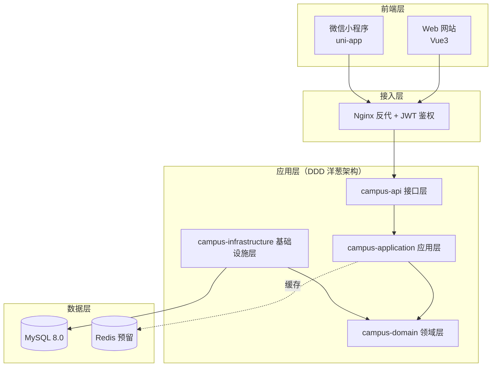
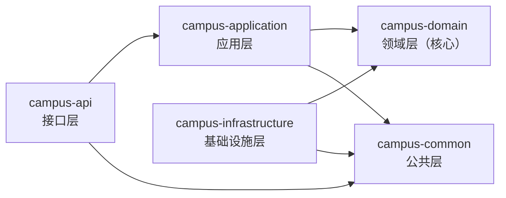
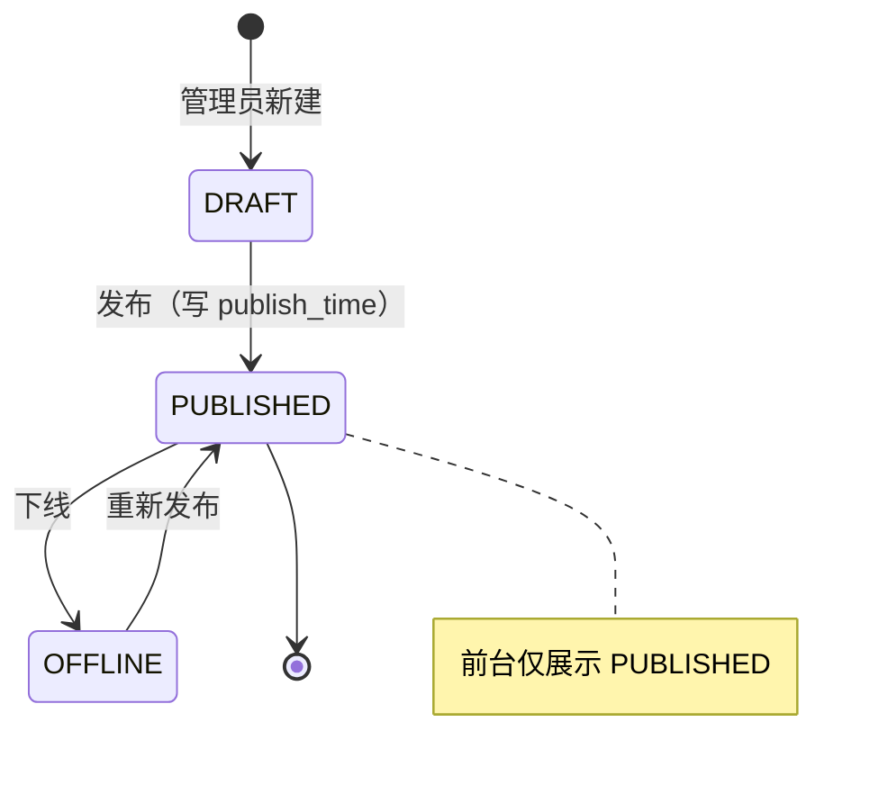
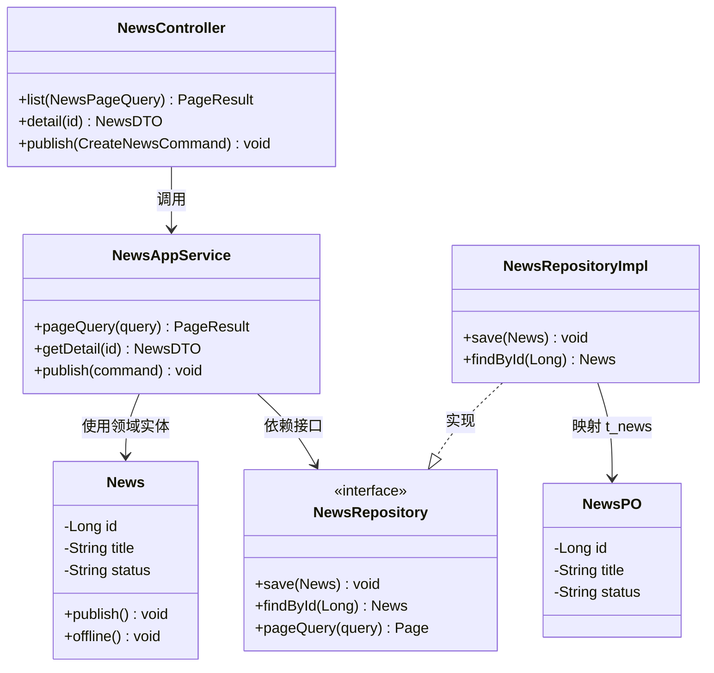
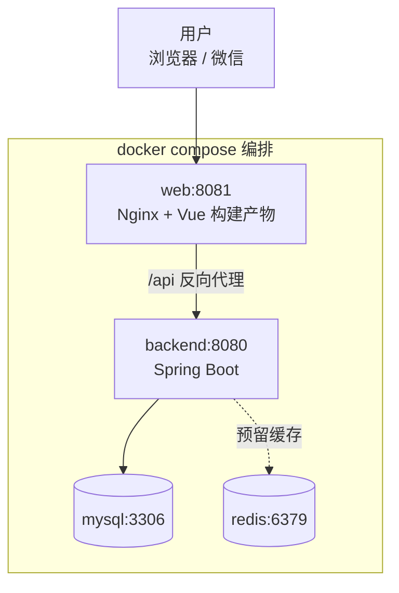

卷    号：________
卷内编号：________
密    级：内部

# CampusOS 高校智慧校园门户系统 架构设计说明书

**Version：** 1.0

| 项目信息 | 内容 |
| --- | --- |
| 项 目 承 担 部 门 | ＿＿大学 软件工程课程实践 ＿组 |
| 撰 写 人（签名） | 刘永聪 |
| 完 成 日 期 | 2026-07-14 |
| 本文档使用部门 | ■主管领导　■项目组　□客户　■维护人员　□用户 |
| 评审负责人（签名） | 李佩泽 |
| 评 审 日 期 | 2026-07-14 |

> ⚠️ **说明**：日期、项目编号为示例，可按实际调整；人员为本组真实成员（李佩泽 2023112471、刘永聪 2023112470、王昕烨 2023112484）。架构、技术选型、模块设计均按 CampusOS 项目实际情况编写。

### 文档信息

- **标题：** CampusOS 高校智慧校园门户系统 架构设计说明书
- **作者：** 刘永聪
- **创建日期：** 2026-07-12
- **上次更新日期：** 2026-07-14
- **版本：** 1.0.20260714

### 修订文档历史记录

| 日期 | 版本 | 说明 | 作者 |
| --- | --- | --- | --- |
| 2026-07-12 | 0.1.20260712 | 草稿 | 刘永聪 |
| 2026-07-13 | 0.9.20260713 | 补充 DDD 洋葱架构分层与新闻模块详细设计 | 刘永聪 |
| 2026-07-14 | 1.0.20260714 | 优化系统接口设计，评审后发布 | 刘永聪 |

---

## 目录

- [1. 系统概述](#1-系统概述)
- [2. 总体架构设计](#2-总体架构设计)
- [3. 技术选型设计](#3-技术选型设计)
- [4. 核心模块详细设计（以"校园新闻模块"为例）](#4-核心模块详细设计以校园新闻模块为例)
- [5. 非功能需求设计](#5-非功能需求设计)
- [6. 数据架构设计](#6-数据架构设计)
- [7. 部署架构设计](#7-部署架构设计)
- [8. 参考资料](#8-参考资料)

---

## 1. 系统概述

### 1.1 项目背景与目标

高校学生日常需在教务、一卡通、后勤、图书馆等多个分散系统间切换，信息入口分散、体验割裂。CampusOS 作为景区服务级别的"一站式校园门户"，旨在整合校园全链条信息与服务，解决信息分散、办事流程冗长等痛点，最终提升学生使用体验与管理效率。本项目同时作为工程实践范例，示范一套可持续扩展的三端同构架构。

### 1.2 系统定位

- **核心角色**：面向学生/教师的统一服务入口（用户端），面向管理员的内容协同平台（管理端）；
- **外部关联**：预留对接真实教务系统、一卡通系统、支付网关、AI 大模型服务的接口，当前聚焦校园门户内部服务闭环；
- **覆盖范围**：涵盖认证、资讯、教务、生活服务、AI 助手 15 大功能，覆盖学生"入学—在校—毕业"全周期高频场景。

### 1.3 核心需求摘要

- **功能需求**：15 个功能模块，本期以校园新闻模块打通"后端四层 → 网站 → 小程序"全链路示例；
- **非功能需求**：
  - **易用性**：界面简洁直观，用户端核心操作 ≤ 3 步；
  - **性能**：核心接口响应 ≤ 500ms，列表分页查询，支持校园日常并发；
  - **兼容性**：网站端适配主流浏览器，小程序端适配 iOS/Android 微信客户端；
  - **安全性**：JWT 鉴权，密码与敏感信息加密存储，统一异常处理。

---

## 2. 总体架构设计

### 2.1 架构分层（纵向）

```
┌─────────────────────────────────────────────┐
│ 前端层   Web网站(Vue3)      微信小程序(uni-app) │
├─────────────────────────────────────────────┤
│ 接入层   Nginx(静态托管+/api反代)  JWT鉴权拦截   │
├─────────────────────────────────────────────┤
│ 应用层   Spring Boot 后端（DDD 洋葱架构，五模块）│
│         api → application → domain ← infrastructure │
├─────────────────────────────────────────────┤
│ 数据层   MySQL 8.0（主）        Redis 6.2（预留缓存）│
├─────────────────────────────────────────────┤
│ 基础设施  Docker / docker compose 容器编排        │
└─────────────────────────────────────────────┘
```

1. **前端层**
   - 用户端：Web 网站（Vue3 SPA）+ 微信小程序（uni-app），共用同一套后端 REST API 与统一 `Result` 结构；
   - 管理端：网站内的后台管理页面（`views/admin/`），按角色控制入口。
2. **接入层**
   - Nginx：网站端静态资源托管 + SPA 路由回退 + `/api` 反向代理到后端 8080；
   - 鉴权：后端统一 JWT 拦截器校验 Token（除登录/注册及公开查询外）。
3. **应用层**：Spring Boot 后端，按 **DDD 洋葱架构**分层（详见 2.2），一个功能一个应用服务（AppService），模块间低耦合。
4. **数据层**：MySQL 存储结构化业务数据；Redis 预留用于热点数据缓存（如新闻列表、验证码）。
5. **基础设施层**：Docker + docker compose 一键编排 MySQL/Redis/后端/网站，保证环境一致性。

总体架构分层图：



### 2.2 后端 DDD 洋葱架构（核心）

后端 `backend/` 为 Maven 多模块，依赖方向由外向内，领域层最内且不依赖任何框架：

| 模块 | 层 | 职责 |
| --- | --- | --- |
| `campus-common` | 公共层 | Result / PageResult / ResultCode、BusinessException、PageQuery，全后端共享，无业务 |
| `campus-domain` | 领域层（最内） | 业务实体（如 `News`，业务规则写在实体方法 `publish()`）、仓储接口（`NewsRepository`），不 import 框架 |
| `campus-application` | 应用层 | 用例编排（`NewsAppService`，含事务），DTO / Command / Query |
| `campus-infrastructure` | 基础设施层 | 数据库落地：PO（`NewsPO`↔`t_news`）、Mapper、Converter、仓储实现（`NewsRepositoryImpl`） |
| `campus-api` | 接口层（最外，唯一可运行） | HTTP 入口 Controller、全局异常处理、框架装配、启动类 `CampusApplication` |

> 依赖规则：`api → application → domain`，`infrastructure → domain`（实现领域层定义的仓储接口）。领域层是稳定核心，替换数据库或 Web 框架不影响业务规则。

模块依赖关系图（箭头指向被依赖方，领域层在最内）：



### 2.3 核心模块划分（横向）

| 中心 | 模块 | 核心职责 | 关键使用者 |
| --- | --- | --- | --- |
| 用户中心 | 登录认证、个人信息 | 统一身份认证与用户资料管理 | 学生、教师、管理员 |
| 资讯中心 | 校园新闻 ✅、公告通知 | 内容发布与浏览、收藏、已读统计 | 全体用户、管理员 |
| 教务中心 | 课程、成绩、考试 | 课表、成绩、考试信息查询 | 学生、教师 |
| 生活服务中心 | 缴费、校园卡、宿舍、报修、二手、活动、地图 | 校园生活各类服务 | 学生 |
| 智能中心 | AI 助手 | 问答、办事流程、智能推荐 | 全体用户 |

### 2.4 系统边界

- **包含范围**：15 个功能模块的应用逻辑、统一鉴权、内容管理、以及支撑的缓存、容器化部署配置。
- **排除范围**：
  - 交易资金流转：缴费/校园卡充值仅约定接口，不接入真实支付清结算；
  - 第三方系统真实对接：教务、一卡通、AI 大模型以接口约定 + 模拟数据示范；
  - 大数据分析：仅存储基础数据，暂不做行为分析。

---

## 3. 技术选型设计

| 技术类别 | 选型方案 | 选型理由 | 版本建议 |
| --- | --- | --- | --- |
| 前端-网站 | Vue3 + Vite + TypeScript + Element Plus + Pinia + Vue Router | 生态成熟、开发效率高、类型安全 | Vue 3.5+、Vite 5+、Element Plus 最新 |
| 前端-小程序 | uni-app（Vue3）+ 微信小程序 | 一套代码多端、贴近 Vue 心智 | HBuilderX + 微信开发者工具 |
| 后端 | Java + Spring Boot + MyBatis-Plus | Java 生态成熟，SpringBoot 简化配置，MyBatis-Plus 提升数据库操作效率，适合结构化业务系统 | Java 17、Spring Boot 3.2、MyBatis-Plus 3.5+ |
| 架构风格 | DDD 洋葱架构（Maven 多模块） | 业务与框架解耦，模块可独立扩展，利于团队并行开发 | — |
| 数据存储 | MySQL、Redis | MySQL 支持事务，适配业务关键数据；Redis 缓存热点数据降低 DB 压力 | MySQL 8.0+、Redis 6.2+ |
| 鉴权 | JWT | 无状态、易于三端共享 | — |
| 接入 | Nginx | 静态托管 + 反向代理 + SPA 路由回退 | 最新稳定版 |
| 部署 | Docker + docker compose | 开发/演示环境一致性，一键起全套 | Docker 20.10+ |

---

## 4. 核心模块详细设计（以"校园新闻模块"为例）

新闻模块是本项目已完整实现的全链路示例，其余模块照此模板扩展。

### 4.1 模块功能详述

#### 4.1.1 核心业务流程

```
管理员登录后台 → 新建/编辑新闻(草稿DRAFT)
     → 发布(PUBLISHED，写 publish_time)
     → 前台(网站/小程序)列表仅查 PUBLISHED
     → 用户查看详情(view_count+1)、收藏
     → 管理员可下线(OFFLINE)，前台不再展示
```

新闻状态流转图：



#### 4.1.2 关键功能拆解（新闻列表查询）

- **输入项**：`categoryId/category`（栏目，可空）、`keyword`（关键词，可空）、`page`、`size`；
- **处理描述**：
  1. Controller `NewsController` 接收请求，组装 `NewsPageQuery`（extends PageQuery）；
  2. `NewsAppService` 编排：仅查询 `status = PUBLISHED`，按 `publish_time` 倒序，走 `idx_status_publish_time` 索引；
  3. `NewsRepositoryImpl` 经 `NewsMapper` 查询 `t_news`，`NewsConverter` 将 PO 转领域实体再转 DTO；
  4. 统一包装为 `PageResult<NewsDTO>` 返回。
- **输出项**：分页新闻列表（id、title、摘要、封面、栏目、浏览量、发布时间）。

#### 4.1.3 核心数据表设计

| 表名 | 核心字段 | 字段说明 |
| --- | --- | --- |
| t_news | id、title、content、category、author、status、view_count、publish_time、deleted | 存储新闻基础信息；status 含 DRAFT/PUBLISHED/OFFLINE；deleted 逻辑删除 |

> 详见《CampusOS 数据库设计说明书》2.2.1。

### 4.2 模块间交互

新闻模块核心类图（DDD 分层落地）：



- **内部交互**：新闻模块自成闭环（Controller → AppService → Domain/Repository），事务在 AppService 层控制；
- **与其他模块交互**：通过统一的用户上下文（JWT 解析出的 userId）识别当前用户（如收藏关系），模块间不直接调用彼此的 Service，降低耦合。

### 4.3 接口设计规范

- 所有后端接口 RESTful，统一响应结构 `Result{ code, msg, data }`；分页用 `PageResult{ total, list }`；
- 前端接口调用统一收敛在 `web/src/api/*.ts`、`miniapp/api/*.js`，经 `request` 封装统一拆包与错误提示；
- 错误统一由后端 `GlobalExceptionHandler` 捕获 `BusinessException` 转为标准 `Result`。

### 4.4 界面设计规范

- **网站端**：列表页（搜索 + 栏目筛选 + 分页）、详情页、后台管理页（发布/下线/删除）；
- **小程序端**：首页最新新闻（下拉刷新 / 上拉加载 / 栏目筛选）、详情页（带参数跳转）。

---

## 5. 非功能需求设计

### 5.1 易用性设计

- 用户端默认展示热门/最新内容，减少筛选成本；列表分页 + 关键词搜索；
- 小程序端下拉刷新、上拉加载符合移动端习惯；表单提供校验提示；核心操作 ≤ 3 步。

### 5.2 安全性设计

- **鉴权**：除登录/注册及公开查询外，所有接口经 JWT 拦截校验；
- **数据安全**：密码加密存储（BCrypt），身份证等敏感信息加密；逻辑删除保留数据可追溯；
- **权限矩阵（示例）**：

| 角色 | 浏览新闻 | 收藏 | 发布/下线新闻 | 用户管理 |
| --- | :---: | :---: | :---: | :---: |
| 游客(未登录) | √ | × | × | × |
| 学生/教师 | √ | √ | × | × |
| 管理员 | √ | √ | √ | √ |

- **登录安全**：支持验证码登录；生产环境需配置 `CAMPUS_JWT_SECRET`、关闭验证码明文返回。

### 5.3 性能设计

- **缓存策略**：Redis 预留缓存新闻列表、验证码等热点/临时数据；
- **数据库优化**：`t_news` 建 `idx_status_publish_time`、`idx_category` 索引，减少查询耗时；分页查询避免全表扫描；
- **接口优化**：列表统一分页（每页默认 10 条），减少数据传输量。

### 5.4 可靠性设计

- **异常处理**：全局异常处理器统一兜底，前端统一错误提示与重试；
- **数据一致性**：写操作在 AppService 层加事务；逻辑删除避免误删不可恢复；
- **高可用**：容器化部署，数据库脚本版本化，可快速重建环境（`docker compose down -v && up -d`）。

---

## 6. 数据架构设计

### 6.1 核心数据模型概要

- **核心实体**：用户、新闻、公告、课程、成绩、考试、报修、二手商品、活动；
- **关键关联**：
  - 用户 1—N 成绩/考试/报修/商品；
  - 用户 N—M 活动（活动报名表）、N—M 公告（公告已读表）、N—M 新闻（收藏表）。

### 6.2 数据存储方案

- **结构化数据（MySQL）**：所有业务表，InnoDB + utf8mb4，主键自增，逻辑删除；
- **缓存（Redis）**：热点数据与验证码（预留）；
- **文件/图片**：URL 字段存储（`cover_image`、`images`），实际文件预留对象存储（如 MinIO/OSS）。

### 6.3 数据流转设计

前端请求 → Nginx `/api` 反代 → Controller → AppService（事务）→ Repository → MyBatis-Plus Mapper → MySQL；响应经 Converter/DTO 组装为 `Result` 原路返回。

---

## 7. 部署架构设计

### 7.1 部署拓扑

```
docker compose 编排：
┌── mysql (3306)      持久化业务数据
├── redis (6379)      缓存(预留)
├── backend (8080)    Spring Boot，/api/**
└── web (8081→nginx)  Vue 构建产物 + /api 反代 backend
```

- **一键部署**：`docker compose up -d --build`，首次自动执行 `docs/sql/` 全部脚本建库建表 + 示例数据；
- **开发模式**：仅 `docker compose up -d mysql redis`，后端在 IDEA 跑、网站 `npm run dev` 热更新。

### 7.2 系统功能结构图

部署拓扑图：



用户端（网站/小程序）→ 统一 API 网关（Spring Boot）→ 用户中心 / 资讯中心 / 教务中心 / 生活服务中心 / 智能中心 → MySQL + Redis。

---

## 8. 参考资料

- 《CampusOS README / 贡献指南 / 新增功能指南》
- 《CampusOS 软件需求规约》《CampusOS 数据库设计说明书》《CampusOS API 接口文档》
- 《Spring Boot 官方文档》《MyBatis-Plus 官方文档》《Vue3 / uni-app 官方文档》
