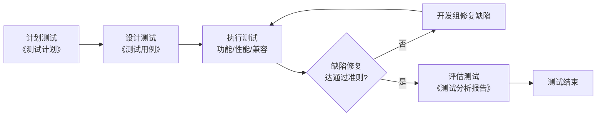

卷号：________
卷内编号：________
密级：内部

# CampusOS 高校智慧校园门户系统

## 测试计划

**项目编号：** CampusOS-2026-TP-006
**Version：** 1.0

| 项目信息 | 内容 |
| --- | --- |
| 项 目 承 担 部 门 | ＿＿大学 软件工程课程实践 ＿组 |
| 撰 写 人（签名） | 王昕烨 |
| 完 成 日 期 | 2026-07-17 |
| 本文档使用部门 | ■主管领导　■项目组　□客户　□维护人员　□用户 |
| 评审负责人（签名） | 李佩泽 |
| 评 审 日 期 | 2026-07-18 |

> ⚠️ **说明**：日期、项目编号为示例，可按实际调整；人员为本组真实成员（李佩泽 2023112471、刘永聪 2023112470、王昕烨 2023112484）。测试需求、策略、准则按 CampusOS 项目实际编写。

### 文档信息

- **标题：** CampusOS 高校智慧校园门户系统-测试计划
- **作者：** 王昕烨
- **创建日期：** 2026-07-17
- **上次更新日期：** 2026-07-18
- **版本：** V1.0
- **部门名称：** ＿组

### 修订文档历史记录

| 日期 | 版本 | 说明 | 作者 |
| --- | --- | --- | --- |
| 2026-07-16 | 0.9 | 草稿 | 王昕烨 |
| 2026-07-18 | 1.0 | 正式发布 | 王昕烨 |

---

## 目录

- [1. 简介](#1-简介)
- [2. 测试需求](#2-测试需求)
- [3. 测试策略](#3-测试策略)
- [4. 资源](#4-资源)
- [5. 项目测试活动](#5-项目测试活动)
- [6. 附录 A：项目任务](#6-附录-a项目任务)

---

## 1. 简介

### 1.1 目的

CampusOS 高校智慧校园门户系统"软件测试计划"文档有助于实现以下目标：

- 确定 CampusOS 系统需测试的软件构件（三端：后端 API、网站端、小程序端）；
- 确定测试需求；
- 确定测试策略并加以说明；
- 确定所需资源，并对测试工作量进行估计；
- 列出项目测试的可交付工件。

### 1.2 背景

CampusOS 是一套"Spring Boot 后端 + Vue3 网站 + 微信小程序"三端同构的校园门户，规划 15 个功能模块，本期以校园新闻模块作为全链路示例实现。系统包括以下子系统：登录认证、个人信息、校园新闻、公告通知、课程、成绩、考试、缴费、校园卡、宿舍、报修、二手交易、活动、地图导航、AI 助手。本次测试以已实现功能（新闻模块全链路）为重点，兼顾其余模块接口约定的可测部分。

### 1.3 范围

- 本项目的测试工作为系统测试阶段，含计划测试、设计测试、执行测试、评估测试四个活动；
- 本测试计划仅对项目自研软件提供测试，不对第三方软件（如支付网关、AI 大模型服务）本身进行测试，但需测试自研软件与第三方之间的接口；
- 本测试计划适用于"CampusOS 高校智慧校园门户系统"项目，供项目经理及各组（测试组、开发组）使用。

### 1.4 定义

**缺陷级别定义：**

- **一级**：不能完全满足系统要求，基本功能未实现；或危及数据安全。
- **二级**：严重影响系统要求或基本功能实现，且无更正办法（重装/重启不算更正办法）。
- **三级**：严重影响系统要求或基本功能实现，但存在合理更正办法。
- **四级**：使操作者不便或遇到麻烦，但不影响主要功能。
- **五级**：其他缺陷（如文案、样式细节）。

### 1.5 文档引用

- 《CampusOS 项目开发计划》
- 《CampusOS 软件需求规约》
- 《CampusOS API 接口文档》

---

## 2. 测试需求

> 备注：优先级 1-高、2-中、3-低。

### 2.1 功能测试需求

| 测试需求 | 测试需求简介 | 优先级 |
| --- | --- | :---: |
| 用户登录 | 账号密码 / 手机验证码 / 微信授权登录，Token 签发与鉴权 | 1 |
| 校园新闻浏览 | 新闻列表分页、栏目筛选、关键词搜索、详情查看、浏览量自增 | 1 |
| 新闻收藏 | 登录用户收藏 / 取消收藏、查看收藏列表 | 2 |
| 新闻后台管理 | 管理员发布、草稿/发布/下线状态流转、删除；前台仅展示已发布 | 1 |
| 公告通知 | 公告列表/详情、标记已读、未读数量统计 | 2 |
| 个人信息 | 查看/修改资料、修改头像、修改密码、实名认证 | 2 |
| 课程查询 | 个人课表、今日课程、空闲教室查询 | 2 |
| 成绩查询 | 成绩列表、GPA 计算、统计分析 | 2 |
| 考试安排 | 考试列表、考试日历查询 | 2 |
| 校园卡/缴费 | 余额/记录查询、充值、缴费下单（接口层） | 2 |
| 报修 | 提交报修、进度查询、评价 | 2 |
| 二手交易 | 发布、列表筛选、收藏、下单 | 3 |
| 活动报名 | 活动列表、报名/取消、签到 | 3 |
| 退出登录 | 登录后退出、Token 失效 | 3 |

### 2.2 非功能测试需求

| 测试需求项 | 条件 | 指标 |
| --- | --- | --- |
| 性能 | 查询响应时间 | 核心查询接口响应 ≤ 3 秒，高频接口 ≤ 500ms |
| 性能 | 页面响应时间 | 首屏加载 ≤ 2 秒 |
| 界面 | 通用图形界面 | 网站端支持鼠标键盘，小程序端支持触控，界面正常显示、正常运行 |
| 兼容性 | 浏览器/客户端 | 网站端兼容 Chrome/Edge/Firefox；小程序端兼容 iOS/Android 微信客户端 |
| 安全性 | 鉴权 | 未登录访问受保护接口返回 401；越权访问返回 403 |

---

## 3. 测试策略

### 3.1 测试类型

本次测试为系统测试，具体如下：

#### 3.1.1 功能测试策略

- **测试目标**：所有功能测试需求项的功能实现。
- **测试方法和技术**：按测试需求、通过准则、测试用例，采用黑盒法测试，核实：
  - 使用合法数据时得到正确结果（如正确账号密码登录成功、发布后前台可见）；
  - 使用非法数据时显示相应的缺陷/警告信息（如错误密码提示、未登录访问受保护接口拦截）；
  - 各业务规则正确应用（如前台仅查 PUBLISHED、逻辑删除后不再展示）。
- **完成标准**：所计划测试全部执行；缺陷修复率达通过准则；提供《测试记录》。
- **需考虑的特殊事项**：三端（后端 API / 网站 / 小程序）需分别验证同一功能的表现一致性。

#### 3.1.2 性能测试策略

- **测试目标**：所有性能测试需求项的正常实现。
- **测试方法和技术**：测试环境参见"系统资源"，主要针对接口响应时间、并发查询能力测试，可用 JMeter 压测核心接口。
- **完成标准**：所计划测试全部执行；系统运行稳定；性能指标符合要求；提供《系统性能测试记录表》。

#### 3.1.3 兼容性测试策略

- **测试目标**：网站端兼容 Chrome/Edge/Firefox 主流浏览器；小程序端兼容 iOS/Android 微信客户端。
- **测试方法和技术**：在各浏览器/设备下运行系统，检查界面显示与功能。
- **完成标准**：各环境下正常显示、功能正常运行。

### 3.2 测试工具

| 名称 | 工具 | 版本 |
| --- | --- | --- |
| 接口测试 | Postman / Apifox | 最新 |
| 性能测试 | JMeter | 5.6 |
| 单元测试 | JUnit 5 + Spring Boot Test | 随 Spring Boot 3.2 |
| 缺陷/任务管理 | GitHub Issues | — |
| 小程序调试 | 微信开发者工具 | 最新 |

### 3.3 测试通过准则

- 实行了所有测试策略并达到完成标准；
- 测试结束后，开发组对实现有误的测试需求项的修改达到：
  - 一、二级缺陷修复率 100%；
  - 三、四级缺陷修复率 80% 以上；
  - 五级缺陷修复率 60% 以上；
- 《需求规约》《接口文档》与编码实现一致。

---

## 4. 资源

### 4.1 角色

| 角色 | 人员 | 具体职责或注释 |
| --- | --- | --- |
| 测试经理 | 李佩泽 | 管理监督：提供技术指导、获取资源、提供管理报告 |
| 测试设计员 | 刘永聪、王昕烨 | 计划测试、设计测试及评估测试；确定测试用例与优先级并实施 |
| 测试员 | 王昕烨 | 执行测试、记录结果、从缺陷中恢复 |

### 4.2 系统资源

- **硬件环境**：开发/测试用个人电脑（内存 ≥ 8GB，可运行 Docker）；服务端由 docker compose 本地容器提供。
- **软件环境**：MySQL 8.0、Redis、后端 Spring Boot（8080）、网站 Nginx（8081）、微信开发者工具、浏览器、Postman/JMeter。

---

## 5. 项目测试活动

| 里程碑任务 | 工作 | 开始日期 | 结束日期 | 交付工件 |
| --- | --- | --- | --- | --- |
| 计划测试 | 阅读参考资料，制定测试计划，分派测试任务 | 2026-07-16 | 2026-07-17 | 《测试计划》 |
| 设计测试 | 根据测试计划、用例阐述与设计来设计测试用例 | 2026-07-17 | 2026-07-18 | 《测试用例》 |
| 执行测试 | 进行系统测试：功能测试、性能测试、兼容测试 | 2026-07-18 | 2026-07-19 | 《测试记录》 |
| 评估测试 | 编写《测试分析报告》 | 2026-07-19 | 2026-07-20 | 《测试分析报告》 |

测试活动流程图：

---

## 6. 附录 A：项目任务

以下是一些与测试有关的任务：

- **制定测试计划**：确定测试需求、评估风险、制定测试策略、确定测试资源、创建时间表、生成测试计划。
- **设计测试**：准备工作量分析文档、确定并说明测试用例、确定测试过程并建立结构、复审和评估测试覆盖。
- **执行测试**：执行测试过程、评估测试执行情况、恢复暂停的测试、核实结果、调查意外结果、记录缺陷。
- **对测试进行评估**：评估测试用例覆盖、评估代码覆盖、分析缺陷、确定是否达到测试完成标准与成功标准。
